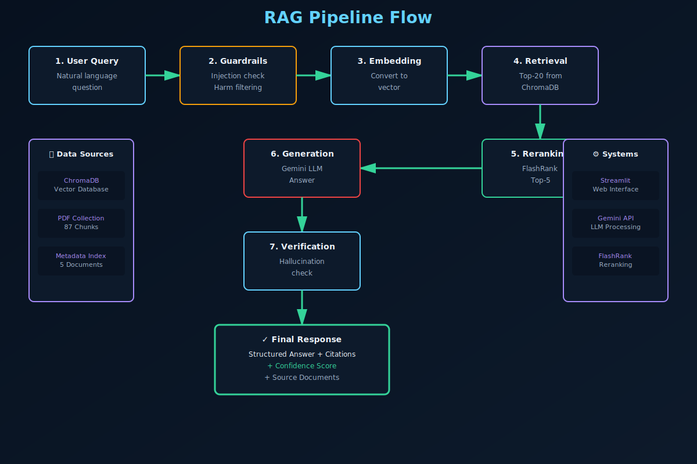
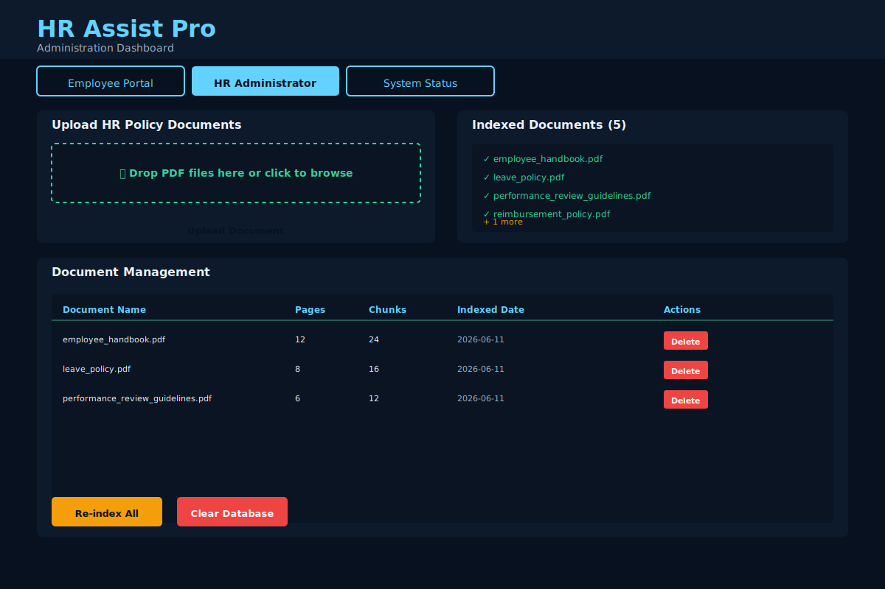

# HR Assist Pro


Enterprise-grade HR Retrieval-Augmented Generation (RAG) workflow application built with **Streamlit**, **ChromaDB**, **FlashRank**, and the latest **Google GenAI SDK**.

## Overview

HR Assist Pro is an intelligent HR policy assistant that helps employees find answers to HR-related questions using a combination of semantic search, reranking, and advanced language models. The system retrieves relevant policy documents, verifies responses for hallucinations, and provides citation-backed answers.

### Key Capabilities

- **Employee-facing HR Q&A**: Ask natural language questions and receive structured policy responses
- **PDF Ingestion**: Automatic page-level parsing, chunking, embedding, and persistent storage
- **Two-Stage Retrieval**: ChromaDB semantic search (top-20) → FlashRank reranking (top-5)
- **Smart Guardrails**: Prompt injection prevention, harmful request detection, non-HR question filtering
- **Verification System**: Hallucination warnings and automatic Gemini failover
- **Admin Controls**: Document management, indexing, and deletion workflows
- **Pre-loaded Data**: Sample HR PDFs for immediate testing

## Features

- ✅ Employee-facing HR question answering with structured policy responses
- ✅ PDF ingestion with page-level parsing, chunking, embedding, and ChromaDB persistence
- ✅ Delete and update workflows using document metadata
- ✅ Two-stage retrieval: top-20 Chroma retrieval followed by FlashRank reranking to top-5
- ✅ Guardrails for prompt injection, harmful requests, and non-HR questions
- ✅ Output verification with hallucination warnings and Gemini failover
- ✅ Automatic sample HR PDFs so the app runs immediately after setup
- ✅ Streamlit-based intuitive user interface
- ✅ ChromaDB vector database for scalable similarity search
- ✅ Google Generative AI integration for advanced language understanding

## RAG Pipeline

The HR Assist Pro system follows a seven-stage RAG (Retrieval-Augmented Generation) pipeline:

1. **Input Validation** - User query is checked for injection attacks and harmful content
2. **Embedding** - Query is converted to vector representation
3. **Semantic Retrieval** - Top-20 similar chunks retrieved from ChromaDB
4. **Reranking** - Results are reranked to top-5 most relevant chunks using FlashRank
5. **LLM Generation** - Gemini generates structured response with citations
6. **Verification** - Output is verified for hallucinations
7. **Response Delivery** - Final answer with confidence scores and sources

### RAG Pipeline Diagram



## Architecture

```
┌─────────────────────────────────────────────────────────────┐
│                    Streamlit Frontend                        │
│  (Employee Portal | Admin Panel | System Status)             │
└─────────────────────┬───────────────────────────────────────┘
                      │
        ┌─────────────┼─────────────┐
        │             │             │
   ┌────▼──┐    ┌────▼──┐    ┌───▼────┐
   │ Input │    │ Query │    │ Upload │
   │Validation│ Processing│ │ Handler│
   └────┬──┘    └────┬──┘    └───┬────┘
        │            │            │
   ┌────▼────────────▼────────────▼────┐
   │      RAG Pipeline Module            │
   ├─────────────────────────────────────┤
   │ • PDF Parsing & Chunking            │
   │ • Embedding Generation              │
   │ • Semantic Retrieval (ChromaDB)     │
   │ • Reranking (FlashRank)             │
   │ • Response Generation (Gemini)      │
   │ • Hallucination Detection           │
   └─────────────────────────────────────┘
        │
   ┌────▼──────────────────┐
   │  Persistent Storage   │
   ├──────────────────────┤
   │ • ChromaDB Vector DB │
   │ • PDF Collections    │
   │ • Metadata Index     │
   └──────────────────────┘
```

## Project Structure

```text
RAG_SYSTEM/
├── app.py                      # Streamlit main application
├── llm.py                      # Google GenAI integration
├── ingest.py                   # PDF ingestion & ChromaDB management
├── rag_pipeline.py             # RAG retrieval pipeline
├── reranker.py                 # FlashRank reranking module
├── guardrails.py               # Security & validation guardrails
├── utils.py                    # Utility functions
├── requirements.txt            # Python dependencies
├── README.md                   # This file
├── chroma_db/                  # Vector database storage
│   ├── chroma.sqlite3
│   └── index_manifest.json
└── sample_pdfs/                # Sample HR documents
    ├── employee_handbook.pdf
    ├── leave_policy.pdf
    ├── performance_review_guidelines.pdf
    ├── reimbursement_policy.pdf
    └── uploads/                # User-uploaded PDFs
        ├── Performance_Management_Policy.pdf
        └── Work_From_Home_Policy.pdf
```

## Quick Start

### Prerequisites

- Python 3.9+
- Google GenAI API Key ([Get one here](https://ai.google.dev/))
- pip or conda package manager

### Installation

1. **Clone the repository**
   ```bash
   git clone https://github.com/sayada-ume/RAG_SYSTEM.git
   cd RAG_SYSTEM
   ```

2. **Create a Python virtual environment**
   ```bash
   python -m venv .venv
   source .venv/bin/activate  # On Windows: .venv\Scripts\activate
   ```

3. **Install dependencies**
   ```bash
   pip install -r requirements.txt
   ```

4. **Set up environment variables**
   ```bash
   # Create .env file
   echo 'GOOGLE_GENAI_API_KEY=your_api_key_here' > .env
   ```

5. **Run the application**
   ```bash
   streamlit run app.py
   ```

   The app will open at `http://localhost:8501`

## Usage

### For Employees

1. **Employee Portal Tab**
   - Type your HR policy question in the text area
   - Click "Get HR Answer"
   - View the AI-generated response with citations
   - See source documents and page numbers

### For HR Administrators

1. **HR Administrator Panel Tab**
   - Upload new HR policy PDFs
   - View indexed documents
   - Delete or refresh the knowledge base
   - Manage document metadata

2. **System Status Tab**
   - Monitor indexing status
   - Check document count and chunk statistics
   - Verify Gemini API connectivity

## Configuration

### Environment Variables

Create a `.env` file in the project root:

```env
GOOGLE_GENAI_API_KEY=your_google_genai_api_key
```

### Dependencies

Key packages (see `requirements.txt` for full list):

- **streamlit** >= 1.36.0 - Web framework
- **chromadb** >= 0.5.5 - Vector database
- **google-genai** >= 0.5.0 - LLM integration
- **pypdf** >= 4.3.0 - PDF parsing
- **flashrank** >= 0.2.10 - Reranking
- **reportlab** >= 4.2.0 - PDF generation

## User Interface

### Employee Portal

The Employee Portal allows employees to ask HR policy questions and receive structured, citation-backed answers.


**Features:**
- Natural language question input
- Real-time response generation
- Source document citations
- Confidence scoring

### HR Administrator Panel

The HR Administrator Panel provides tools for managing the knowledge base and uploading new policy documents.



**Features:**
- PDF document upload and management
- Indexed document overview
- Document deletion and re-indexing
- Metadata management

### System Status Dashboard

Monitor the health and performance of the HR Assist Pro system.


**Metrics Tracked:**
- Total indexed documents and chunks
- Last indexing timestamp
- API connectivity status
- Database health
- System operational status

## How It Works

### 1. Document Ingestion
- PDF files are parsed into pages
- Pages are split into overlapping chunks
- Chunks are embedded using ChromaDB's default embedding model
- Metadata (source, page number) is preserved

### 2. Query Processing
- User query is validated through guardrails
- System checks for prompt injection, harmful content
- Query is embedded in the same space as documents

### 3. Retrieval & Ranking
- ChromaDB retrieves top-20 semantically similar chunks
- FlashRank reranks results to top-5 by relevance
- Higher-quality context is passed to the LLM

### 4. Response Generation
- Gemini 2.0 Flash generates structured answers
- Includes policy citations and page references
- System detects and warns about potential hallucinations

### 5. Verification
- Output is checked against retrieved documents
- Fallback to policy excerpts if verification fails
- User sees confidence indicators

## System Requirements

- **RAM**: 4GB minimum (8GB recommended)
- **Storage**: 2GB for ChromaDB and sample PDFs
- **Network**: Internet connection (for Gemini API)
- **GPU**: Optional (CPU works fine)

## Troubleshooting

### Common Issues

**Issue**: `ImportError: DLL load failed while importing cygrpc`
**Solution**: Set environment variable before running:
```bash
set CHROMA_TELEMETRY_DISABLED=True
streamlit run app.py
```

**Issue**: `Missing GOOGLE_GENAI_API_KEY`
**Solution**: Ensure `.env` file exists with valid API key

**Issue**: PDFs not indexing
**Solution**: Check that sample_pdfs folder exists and contains valid PDF files

## Contributing

Contributions are welcome! Please feel free to submit a Pull Request.

## License

This project is licensed under the MIT License - see the LICENSE file for details.

## Support

For deployment issues:
1. Check the [README](README.md)
2. Review logs for errors
3. Open a GitHub issue with details
4. Contact the development team

## Documentation

- **[Architecture](ARCHITECTURE.md)** - System design and components
- **[Deployment Guide](DEPLOYMENT.md)** - Production deployment instructions
- **[Contributing Guide](CONTRIBUTING.md)** - How to contribute
- **[Code of Conduct](CODE_OF_CONDUCT.md)** - Community standards
- **[License](LICENSE)** - MIT License

---

**Built with ❤️ for better HR workflows**
